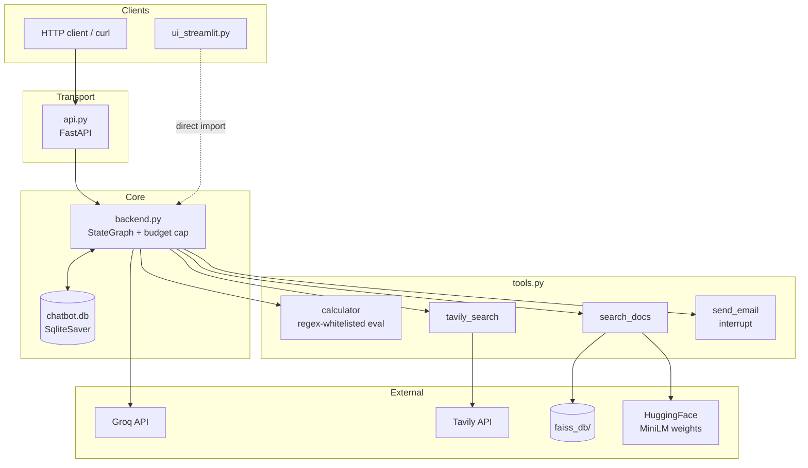
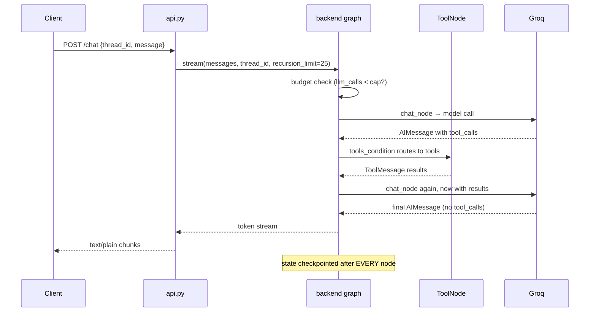
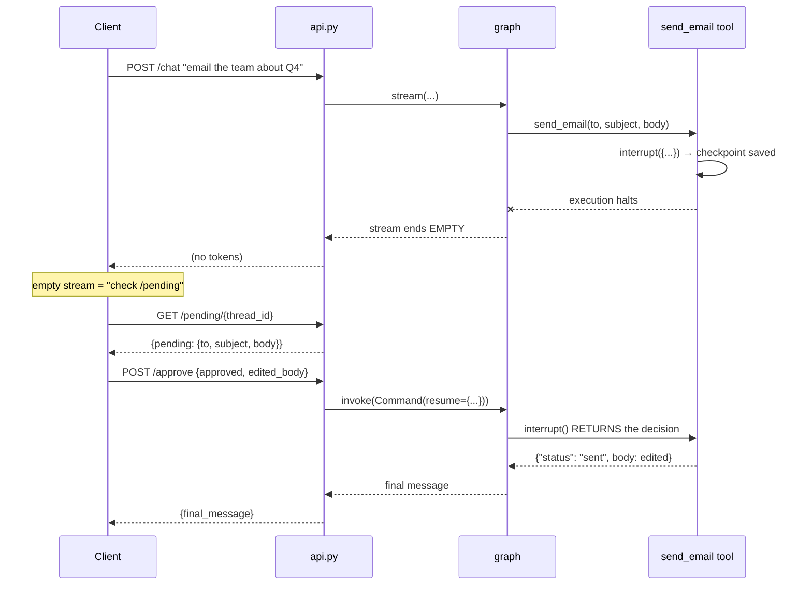
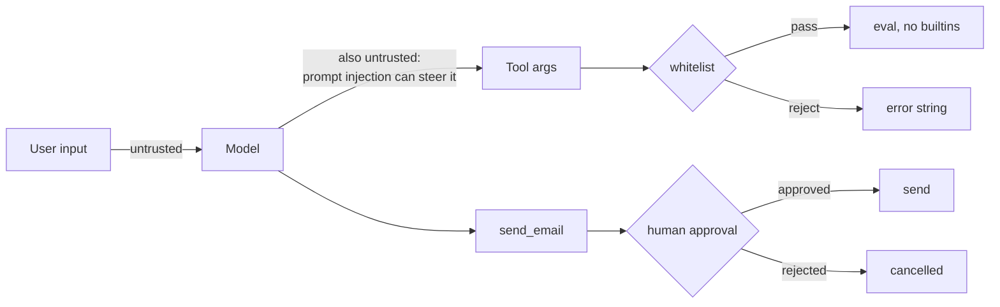

# Architecture — ChatGPT-style Agent (Module 10)

The capstone combining Modules 6–9. This document covers components, data flow, integrations, error paths, security boundaries and the design decisions behind them.

---

## 1. Components and responsibilities

| File | Responsibility | Must NOT |
|---|---|---|
| `tools.py` | Everything the agent can *do*: arithmetic, web search, PDF retrieval, email-with-approval. Owns the embedding model and vector store path. | know anything about HTTP or the graph |
| `backend.py` | The graph: nodes, edges, the system prompt, the checkpointer, the budget cap. Exposes `agent`, `all_thread_ids()`, `pending_approval()`. | import FastAPI |
| `api.py` | HTTP transport only: request/response shapes, streaming, endpoint routing. | contain agent logic |
| `ingest.py` | One-off: PDF → FAISS index. | run at request time |
| `ui_streamlit.py` | Optional local UI. Talks to the graph **directly**, not via HTTP. | be required for the API to work |

**The load-bearing decision:** `backend.py` imports no web framework. That's why Module 15's eval harness and Module 16's test suite can `from backend import agent` without starting a server.

---

## 2. Component diagram



---

## 3. Data flow — a normal turn



**Key property:** state is saved after each node, keyed by `thread_id`. Memory, time travel and crash recovery are all consequences of that one mechanism, not separate features.

---

## 4. Data flow — the approval path

This is the only flow that cannot complete in one request, because a human has to intervene.



**The counter-intuitive part:** `/chat` returns an **empty stream** when the agent pauses. Not an error — the graph stopped before producing assistant text. An empty stream is the client's signal to poll `/pending`.

**ADR-adjacent note:** the alternative was holding the HTTP request open until a human answered. Rejected — it would tie up a worker indefinitely and die on any timeout or page refresh. Two endpoints plus a checkpoint is stateless and survives a client restart.

---

## 5. State schema

```python
class ChatState(MessagesState):   # MessagesState provides `messages` + add_messages reducer
    llm_calls: int                # budget counter, added by Module 15's audit
```

| Field | Reducer | Why |
|---|---|---|
| `messages` | `add_messages` (appends, dedupes by id) | conversation history; appending is what makes replay safe |
| `llm_calls` | default (last write wins) | a counter only ever written by one node |

Threads are isolated by `thread_id`; two threads never see each other's state.

---

## 6. External integrations

| Service | Used by | Failure mode | Handling |
|---|---|---|---|
| **Groq** | `backend.py` | dead model → 404; rate limit → 429 | **not handled** — propagates as a 500. See §9. |
| **Tavily** | `tools.py:web_search` | missing key at *construction* time | `load_dotenv()` lives in `tools.py` because the key is read at import |
| **HuggingFace** | `tools.py:EMBEDDINGS` | ~90MB download on first use | Dockerfile pre-bakes it so cold containers don't pay it |
| **FAISS** (local) | `search_docs` | index absent | returns `"No document has been uploaded yet."` as text |
| **SQLite** (local) | checkpointer | wiped on free-tier redeploy | documented limitation; `PostgresSaver` is the fix |

---

## 7. Error paths

The governing rule, from Module 7: **tools return errors as strings; they never raise.** A raise aborts the whole graph run; a returned string goes back to the model, which can read it and retry.

| Failure | Behaviour |
|---|---|
| Bad arithmetic expression | `"error: only numbers and + - * / % ( ) are allowed"` |
| `eval` throws | `"error: {e}"` |
| No FAISS index | `"No document has been uploaded yet."` |
| No relevant chunks | `"No relevant passages found."` |
| Budget exhausted | polite `AIMessage`, **no model call spent** |
| Runaway tool loop | `recursion_limit=25`, plus the budget cap bounds it |
| Groq unavailable | ⚠️ unhandled — 500 to the client |

---

## 8. Security boundaries



| Boundary | Control |
|---|---|
| **LLM-generated expressions** | `SAFE_EXPR = [0-9.\s+\-*/%()]+` whitelist **before** `eval`, with `{"__builtins__": {}}`. No names can appear, so no attribute tricks. |
| **Irreversible actions** | `send_email` requires `interrupt()` approval; the human may edit the body first |
| **Secrets** | `.env` only; gitignored; excluded via `.dockerignore`; never baked into the image |
| **Deserialization** | `allow_dangerous_deserialization=True` is required by FAISS — acceptable only because *we* built the index. Never load a downloaded one. |
| **Spend** | `MAX_LLM_CALLS_PER_THREAD`, checked before the call |

**Known gap:** `tavily_search` and `search_docs` run ungated. Only the one irreversible action is gated. That's a deliberate line, recorded in Module 15's audit (row 5) rather than enforced in code.

---

## 9. Design decisions and trade-offs

| Decision | Alternative | Why this way |
|---|---|---|
| `backend.py` free of web code | one file | lets evals/tests import the agent without a server — used by Modules 15 and 16 |
| Retrieval as a **tool** | a node that always retrieves | "Hi there!" shouldn't trigger a vector search. Verified in Module 8. |
| Approval **inside** the tool | approval in the conversation | attaches the gate to the dangerous action, so it can't be routed around |
| `SqliteSaver` | `InMemorySaver` | survives restarts; the cost is it doesn't survive free-tier redeploys |
| Whitelist + `eval` | a parser or `ast` walker | 5 lines, genuinely safe here, no dependency |
| Python sums the budget | ask the model | models miscount; the cap must be exact |
| Provider via env var | hardcoded model | one flip to OpenAI — see [`../OpenAI.md`](../OpenAI.md) |
| Streamlit imports the graph | calls its own API | one process, no CORS, same primitives |

### Accepted limitations

1. **No verification of answers** — nothing grades output. Module 16 addresses this for Module 14; Module 10 is still unguarded.
2. **No context trimming** — history grows forever; Module 7's `trim_messages` exists but isn't wired in.
3. **No thread deletion** — no way to honour "delete my data".
4. **No local observability** — no logging, token counts or latency. LangSmith is opt-in and off by default.
5. **SQLite on free hosts is ephemeral.**

All five are recorded with `file:line` evidence in [`../Module 15 - Harness & Loop Engineering/HARNESS_REVIEW.md`](../Module%2015%20-%20Harness%20&%20Loop%20Engineering/HARNESS_REVIEW.md).

---

## 10. Setup, run, test

```bash
uv sync
uv run python ingest.py sample_notes.pdf     # populate faiss_db/
uv run uvicorn api:app --reload              # API on :8000
uv run streamlit run ui_streamlit.py         # optional UI

MAX_LLM_CALLS_PER_THREAD=3 uv run python budget_demo.py   # budget guard
```

Required: `GROQ_API_KEY`, `TAVILY_API_KEY`. Optional: `CHAT_MODEL`, `EMBED_MODEL`, `CHECKPOINT_DB`, `MAX_LLM_CALLS_PER_THREAD`, `LANGSMITH_*`.

**Verified** (live server, real APIs): `/health`; streaming `/chat`; memory across calls on one `thread_id`; thread isolation; calculator; RAG with page citations; `send_email` pause → `/pending` → `/approve` with `edited_body` reaching the tool; `/threads`; the budget cap; Streamlit boots clean (HTTP 200).

**Not verified:** this module's own `docker build` (it adds an embedding-model pre-bake step that Module 9's verified image lacks); the Streamlit UI has never been clicked through.

## 11. Troubleshooting

| Symptom | Cause | Fix |
|---|---|---|
| Empty `/chat` response | agent paused for approval | poll `/pending/{thread_id}` — working as designed |
| `"No document has been uploaded yet."` | `faiss_db/` missing | `uv run python ingest.py sample_notes.pdf` |
| `"...reached its budget..."` | thread hit the cap | new `thread_id`, or raise `MAX_LLM_CALLS_PER_THREAD` |
| `Did not find tavily_api_key` | key read at import | set `TAVILY_API_KEY`; `tools.py` loads its own env |
| `model ... decommissioned` | Groq retired it | check the live list — `AGENT_RULES.md` #1 |
| Threads vanished after deploy | free-tier disk wipe | `PostgresSaver` |
| Dimension mismatch after switching embeddings | 384 vs 1536 | `rm -rf faiss_db && uv run python ingest.py ...` |
